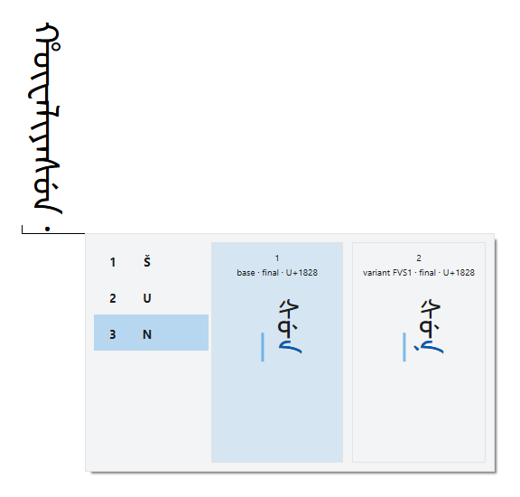

# Manju Script Input Method

**ᠮᠠᠨᠵᡠ ᡥᡝᡵᡤᡝᠨ** (Manju Hergen, the Manchu alphabet)

Manju IME is an input method editor (IME) for Windows: a program that lets you type a script your
keyboard has no keys for, here the Manchu script. You type the spelling of a Manchu word in Latin
letters, and a small window beside the text, the candidate window, shows the word in Manchu letters;
press **Space**, and the word goes into your document.

Manju IME enters only standard characters of Unicode, the standard that numbers every character of every
script: the Manchu letters and punctuation, the variation selectors that pick another form of a letter,
and the separators that set a suffix apart, all as Unicode defines them, and the Latin letters and
symbols you type on a standard keyboard. It uses no private-use characters and no codes that only one
font understands, so any font that follows Unicode draws the text. You spell Manchu in one of six input
schemes, ways of spelling it in Latin letters, and each of them is typed with the Latin letters of a
standard keyboard.

*Typing `šanyan` (white) with the Möllendorff input scheme, where `š` is `s` followed by a tap of
**Shift**.*

*A web page written top to bottom: `hūwaliyasun` (harmony) is entered and `šun` (sun) is being typed, with
the Möllendorff input scheme.*

*Each card shows the whole word with one form of the highlighted letter: `gisun` and `bithe`, typed with
the Möllendorff input scheme.*

*The candidate window in its eight themes, after typing `manju` with the Möllendorff input scheme.*

[Using Manju IME](docs/usage.md) has more pictures, with every key the IME uses.

## Requirements

| Windows | From version | Status |
|---|---|---|
| Windows 11 | 21H2 | Supported |
| Windows 10 | 22H2 | Uncertain (not tested) |

- A 64-bit Intel or AMD processor.
- Manju IME works only in programs that support Unicode text.
- A font for the Manchu script installed in Windows, such as [Noto Sans Mongolian](https://github.com/notofonts/mongolian).
- Installing it needs administrator rights, because it registers Manju IME for the whole computer. On a
  computer your organization manages, ask your IT staff.
  [What Manju IME does to a computer](docs/deployment.md#what-manju-ime-does-to-a-computer) lists every
  change it makes.

## Documentation

| Document | For | What it covers |
|---|---|---|
| [Installing Manju IME](docs/installation.md) | Users | Setup, page by page, and the uninstaller |
| [Using Manju IME](docs/usage.md) | Users | How typing works, the candidate window, every key, the input schemes and the themes |
| [Input schemes](docs/romanization.md) | Users | The six input schemes compared letter by letter, the spellings typed with Shift, the letters each scheme does not use, and where each scheme comes from |
| [Deploying Manju IME](docs/deployment.md) | IT staff | Unattended deployment with scripts for PowerShell, the command shell of Windows, and what Manju IME does to a computer |

## Install

Download the zip file of the latest release from the
[Releases](https://github.com/MetallicPickaxe/Manju-Script-Input-Method/releases) page and unzip it
into a folder you will keep. In the `Installer` folder, run `Install Manju IME.exe`, the setup program.
[Installing Manju IME](docs/installation.md) shows every page of Setup.

[Deploying Manju IME](docs/deployment.md) covers unattended deployment with the PowerShell scripts.

## Use

Press **Win+Space** and pick Manju IME. Type a Manchu word in Latin letters, and press **Space** to
enter it. [Using Manju IME](docs/usage.md) explains the candidate window and every key.

## Uninstall

In the `Installer` folder, run `Uninstall Manju IME.exe`. The files stay in the folder.
[Installing Manju IME](docs/installation.md#uninstall) shows the uninstaller.

## License

- The code of Manju IME is licensed under the MIT license: see [LICENSE](LICENSE), which also contains
  the third-party notices.
- The documentation, this README and the text and pictures in `docs`, and the Refined Romanisation
  (draft) input scheme are licensed under the Creative Commons Attribution 4.0 International license
  (CC BY 4.0): see [docs/LICENSE](docs/LICENSE).

## Acknowledgments

- [HarfBuzz](https://github.com/harfbuzz/harfbuzz), the text shaping engine: Manju IME joins Manchu
  letters with a C# port of HarfBuzz code.
- [Noto Sans Mongolian](https://github.com/notofonts/mongolian): the font of the candidate window.
- [Solarized](https://github.com/altercation/solarized), the color scheme by Ethan Schoonover: the
  colors of the Solarized Dark and So Young themes.
- Weasel, the Windows front end of the [RIME](https://rime.im/) input method engine: Manju IME drew some
  inspiration from it.
- The makers of the five published input schemes: see [Input schemes](docs/romanization.md#acknowledgments).
