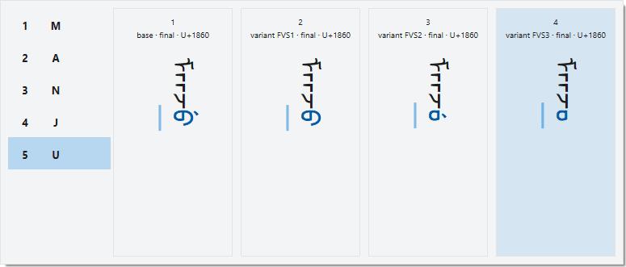
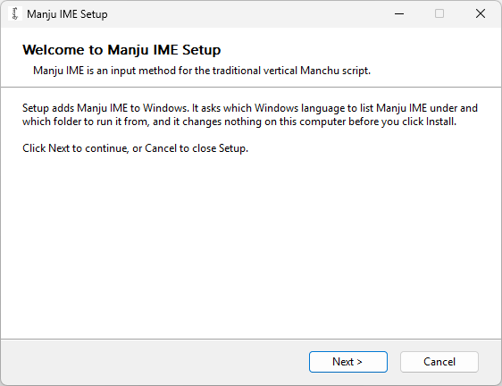

# Manju Script Input Method

**ᠮᠠᠨᠵᡠ ᡥᡝᡵᡤᡝᠨ** (Manju Hergen, the Manchu alphabet)

Manju IME is an input method editor (IME) for Windows: a program that lets you type a script your
keyboard has no keys for, here the Manchu script. You type the spelling of a Manchu word in Latin
letters, and a small window beside the text, the candidate window, shows the word in Manchu letters;
press **Space**, and the word goes into your document.

Manju IME is made for people who are learning Manchu. The candidate window shows one card for each form
the highlighted letter can take, each card the whole word with that form, so you see how a letter changes
with its place in the word, and a number key picks the form. Six input schemes let you type with a
spelling you already know, and whichever of them you type with, the display scheme can show the letters
typed in the spelling you learned, such as Möllendorff’s.

Manju IME enters only standard characters of Unicode, the standard that numbers every character of every
script: the Manchu letters and punctuation, the variation selectors that pick another form of a letter,
and the separators that set a suffix apart, all as Unicode defines them, and the Latin letters and
symbols you type on a standard keyboard. It uses no private-use characters and no codes that only one
font understands, so any font that follows Unicode draws the text. Each of the six input schemes, ways of
spelling Manchu in Latin letters, is typed with the Latin letters of a standard keyboard.

## Examples

Every picture below was taken in Windows 11, one frame for each key, on a web page written top to bottom
in Microsoft Edge; the last one shows the candidate window alone, one frame for each theme. The caption
under each names the input scheme it was typed with.

*`bi manju gisun be tacimbi.` (I study the Manchu language), typed word by word with the Möllendorff input
scheme. **Space** enters each word, and the full stop key gives the Manchu full stop ᠃.*

*The same frames played fast: one frame for each key, with the Möllendorff input scheme.*

*`enduringge` (holy): **Up** and **Down** move the highlight along the letters and the cards change with
it, and **3** picks the card that joins `ng` with the `g` after it. Then `bithe` (book): **Right** moves
across the four forms of its last letter, and **3** picks one. Möllendorff input scheme.*

*`gurun be hūwaliyambumbi` (to bring the country into harmony): the long word has more letters than the
window has rows, and **Page Up** and **Page Down** show the others. Möllendorff input scheme, where `ū`
is `u` followed by a tap of **Shift**.*

*Manchu and Latin letters in one line, `bi Manju IME be baitalambi` (I use Manju IME): a tap of
**Shift** switches between Manchu and Latin input. Möllendorff input scheme.*

*Whole syllables, each shown as one row of the letters typed: `sy`, `tsy`, `dzy`, `chy` and `jy`, typed
with Refined Romanisation (draft), which, like Abkai, types all of them.*

*The Mongolian vowel separator, which sets a suffix apart, typed with the `-` key: `manju-i gisun` and
`bi-de`, with the Möllendorff input scheme.*

*`nga`, where `ng` is one letter, and `n'ga`, where the `'` key separates `n` from `g`. Möllendorff
input scheme.*

*The Manchu comma and full stop in `bi manju, si monggo.` (I am Manchu, you are Mongol), typed with the
Möllendorff input scheme.*

*The display scheme, the spelling that the letters typed are shown in: `shun` typed with Refined
Romanisation (draft) is shown as `šun`, the Möllendorff spelling.*

*`šun` (sun) typed in each of the six input schemes, in the Latin order of their names: `xun` with Abkai
and with BabelPad, `shun` with Hu, `s`, a tap of **Shift** and `un` with Möllendorff and with Norman,
and `shun` with Refined Romanisation (draft).*

*`ere manju hergen i bithe.` (This is a book in the Manchu script), typed with the Möllendorff input
scheme.*

*The candidate window in its eight themes, sets of colors that the settings file picks, after typing
`manju` with the Möllendorff input scheme.*

[Using Manju IME](docs/usage.md) has more pictures, with every key the IME uses.

## Requirements

| Windows | From version | Status |
|---|---|---|
| Windows 11 | 21H2 | Supported |
| Windows 10 | 22H2 | Uncertain (not tested) |

- A 64-bit Intel or AMD processor.
- Manju IME works only in programs that support Unicode text.
- A font for the Manchu script installed in Windows, such as [Noto Sans Mongolian](https://github.com/notofonts/mongolian).
- Installing it needs administrator rights, because it registers Manju IME for the whole computer. On a
  computer your organization manages, ask your IT staff.
  [What Manju IME does to a computer](docs/deployment.md#what-manju-ime-does-to-a-computer) lists every
  change it makes.

## Documentation

| Document | For | What it covers |
|---|---|---|
| [Installing Manju IME](docs/installation.md) | Users | Setup, page by page, and the uninstaller |
| [Using Manju IME](docs/usage.md) | Users | How typing works, the candidate window, every key, the input schemes and the themes |
| [Input schemes](docs/romanization.md) | Users | The six input schemes compared letter by letter, the spellings typed with Shift, the letters each scheme does not use, and where each scheme comes from |
| [Deploying Manju IME](docs/deployment.md) | IT staff | Unattended deployment with scripts for PowerShell, the command shell of Windows, and what Manju IME does to a computer |

## Install

Download the zip file of the latest release from the
[Releases](https://github.com/MetallicPickaxe/Manju-Script-Input-Method/releases) page and unzip it
into a folder you will keep. In the `Installer` folder, run `Install Manju IME.exe`, the setup program.
[Installing Manju IME](docs/installation.md) shows every page of Setup.

[Deploying Manju IME](docs/deployment.md) covers unattended deployment with the PowerShell scripts.

## Use

Press **Win+Space** and pick Manju IME. Type a Manchu word in Latin letters, and press **Space** to
enter it. [Using Manju IME](docs/usage.md) explains the candidate window and every key.

## Uninstall

In the `Installer` folder, run `Uninstall Manju IME.exe`. The files stay in the folder.
[Installing Manju IME](docs/installation.md#uninstall) shows the uninstaller.

## License

- The code of Manju IME is licensed under the MIT license: see [LICENSE](LICENSE), which also contains
  the third-party notices.
- The documentation, this README and the text and pictures in `docs`, and the Refined Romanisation
  (draft) input scheme are licensed under the Creative Commons Attribution 4.0 International license
  (CC BY 4.0): see [docs/LICENSE](docs/LICENSE).

## Acknowledgments

- [HarfBuzz](https://github.com/harfbuzz/harfbuzz), the text shaping engine: Manju IME joins Manchu
  letters with a C# port of HarfBuzz code.
- [Noto Sans Mongolian](https://github.com/notofonts/mongolian): the font of the candidate window.
- [Solarized](https://github.com/altercation/solarized), the color scheme by Ethan Schoonover: the
  colors of the Solarized Dark and So Young themes.
- Weasel, the Windows front end of the [RIME](https://rime.im/) input method engine: Manju IME drew some
  inspiration from it.
- The makers of the five published input schemes: see [Input schemes](docs/romanization.md#acknowledgments).
- [Claude Code](https://www.anthropic.com/claude-code) by Anthropic, the AI coding agent that wrote the code
  and these documents to the author’s design and architecture, and [Codex](https://openai.com/codex/) by
  OpenAI, which reviewed the releases.
