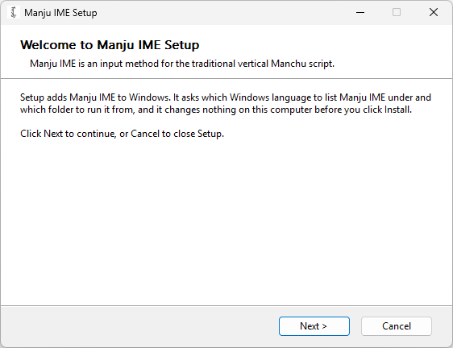
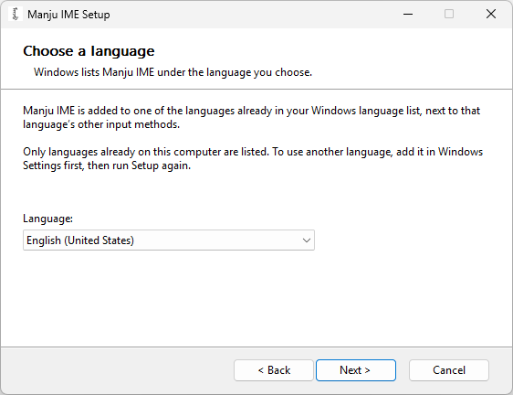
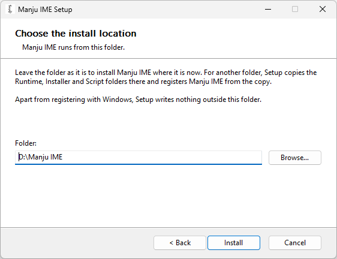
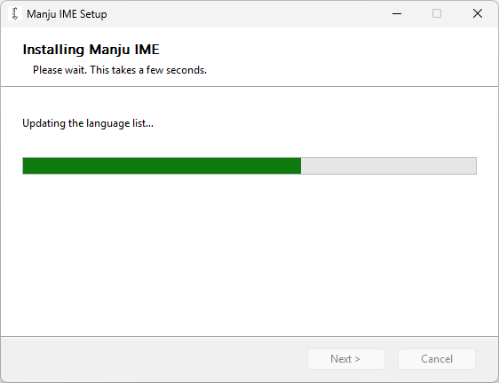
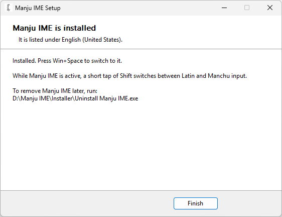
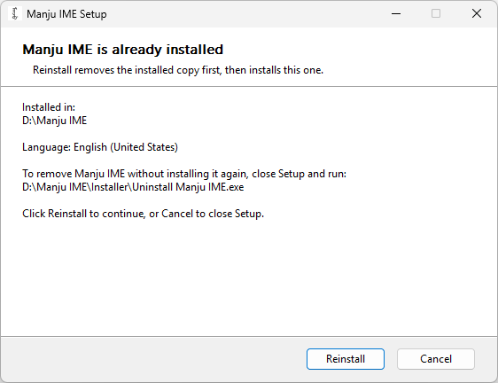
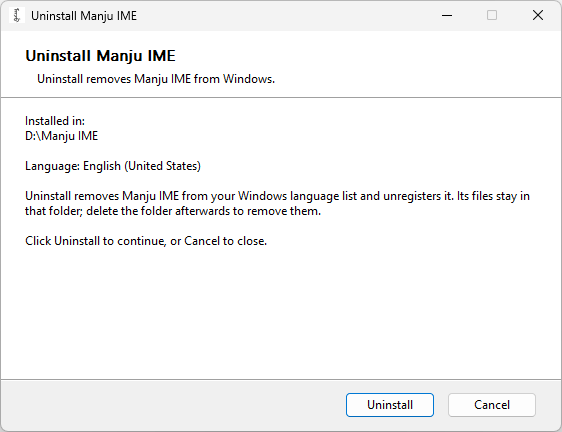
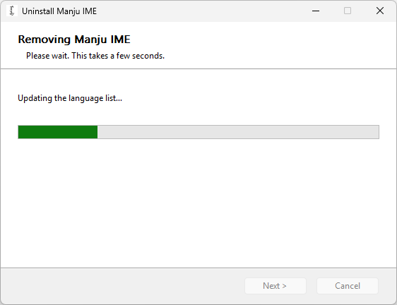
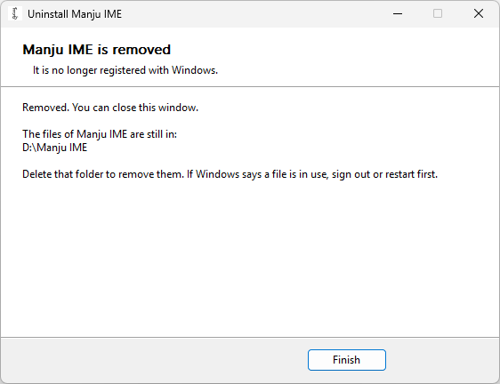

# Installing Manju IME

Manju IME is an input method editor (IME) for Windows: a program that lets you type the Manchu script,
which a keyboard has no keys for. This guide shows how to install it with its setup program, one page at
a time. Check the [requirements](../README.md#requirements) first. In the pictures, Manju IME was
unzipped into `D:\Manju IME`.

The setup program and the uninstaller are the two `.exe` files in the `Installer` folder: programs you
start with a double-click. [What Manju IME does to a computer](deployment.md#what-manju-ime-does-to-a-computer)
lists every change they make.

## Install

1. Download the zip file of the latest release from the
   [Releases](https://github.com/MetallicPickaxe/Manju-Script-Input-Method/releases) page and unzip
   it into a folder you will keep.
2. In the `Installer` folder, run `Install Manju IME.exe`. Windows asks for administrator permission,
   because Setup registers Manju IME for the whole computer.

   

3. Setup asks which Windows language to list Manju IME under, and offers only the languages already
   in your Windows language list. It shows a language that has no language identifier of its own, the
   number by which Windows tells languages apart, such as Anglo-Saxon, in gray and marked Not supported,
   and you cannot choose it: Windows gives such a language a temporary identifier and does not keep an
   input method under it. Then Setup asks which
   folder to run Manju IME from. By default that is the folder Manju IME is in now; for another
   folder, Setup copies Manju IME there.

   

   

4. Click **Install**. The last page says which language Manju IME is listed under.

   

   

### Windows protected your PC

Microsoft Defender SmartScreen is the part of Windows that checks programs downloaded from the internet.
Manju IME is not code-signed, so when you run the downloaded `Install Manju IME.exe`, SmartScreen may show
**Windows protected your PC**. Click **More info**, then **Run anyway**.

Smart App Control, which you turn on and off in the settings of the Windows Security app, does not offer
that choice. Microsoft’s answers about it say: “If the app is unsigned, or the signature is invalid, Smart
App Control will consider it untrusted and block it for your protection,” and “There is currently no way to
bypass Smart App Control protection for individual apps.” While it is on, Setup cannot run. The same page
says that recent Windows updates allow Smart App Control to be turned on again without a clean
installation of Windows.
[What Manju IME does to a computer](deployment.md#what-manju-ime-does-to-a-computer) says what the
programs do before you run them.

### If Manju IME is already installed

Setup opens on this page, in place of the first one. **Reinstall** takes the installed copy out of Windows
and then installs the copy you started Setup from; it deletes no files.

## Switch to Manju IME

Press **Win+Space** and pick Manju IME. It is listed under the language you chose in Setup.
[Using Manju IME](usage.md) says how to type with it.

## Uninstall

In the `Installer` folder, run `Uninstall Manju IME.exe`. It asks for administrator permission,
removes Manju IME from your Windows language list and unregisters it. The files stay in the folder.

Uninstall first, then delete the folder. Programs you typed in keep the input method loaded until they
close, so when Windows says a file is in use, sign out or restart, and delete the folder then.

If you deleted the folder first, Manju IME is still listed in your language settings. Run
`Uninstall Manju IME.exe` from any other copy of the release: it removes the listing and the
registration of the copy whose folder is gone.

## References

- Microsoft Support, [Smart App Control Frequently Asked Questions](https://support.microsoft.com/en-us/windows/smart-app-control-frequently-asked-questions-285ea03d-fa88-4d56-882e-6698afdb7003): what Smart App
  Control blocks, and that it lets no single program through.
- Microsoft, [MS-LCID]: Windows Language Code Identifier (LCID) Reference, section
  [Locale Names without LCIDs](https://learn.microsoft.com/en-us/openspecs/windows_protocols/ms-lcid/926e694f-1797-4418-a922-343d1c5e91a6):
  the temporary identifiers that Windows gives a language without one of its own.

## License

This guide, with its pictures, is licensed under the Creative Commons Attribution 4.0 International
license (CC BY 4.0): see [LICENSE](LICENSE).
