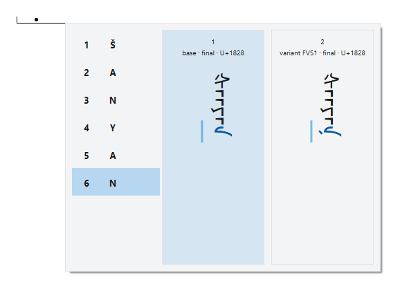
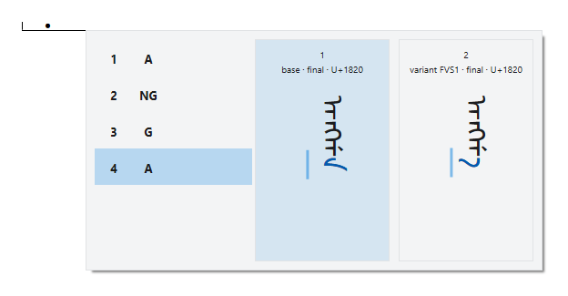
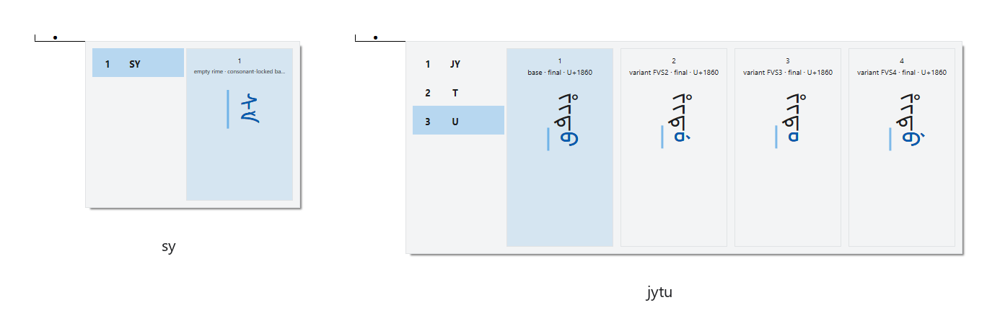
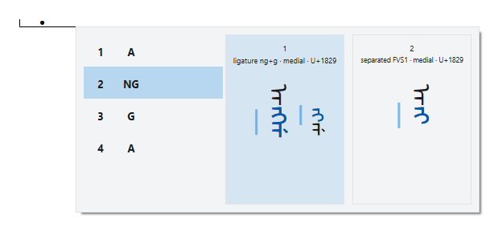
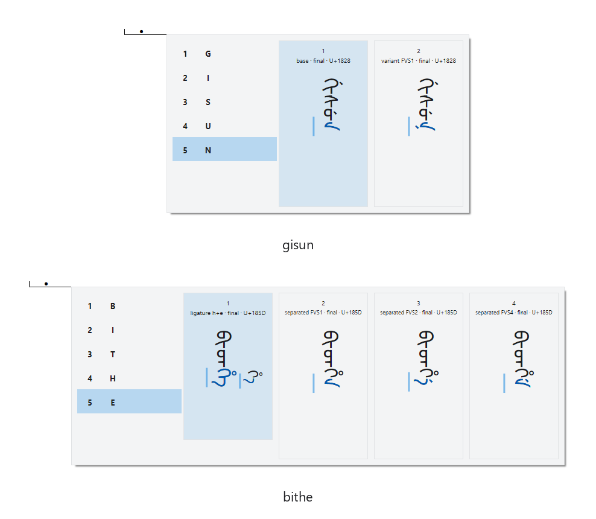
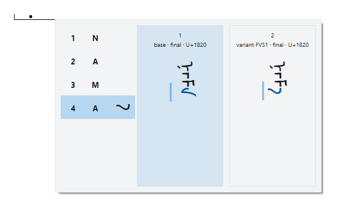
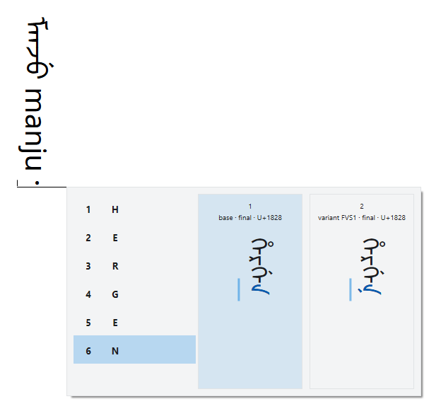
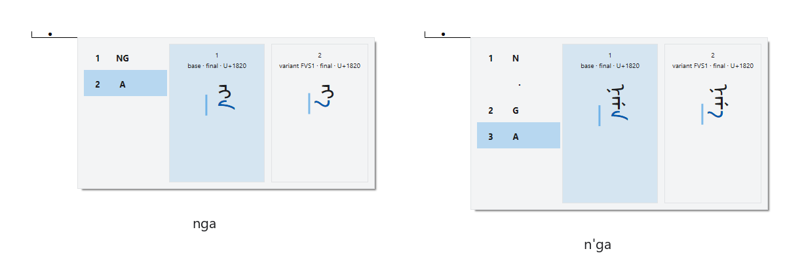
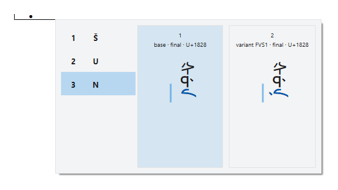
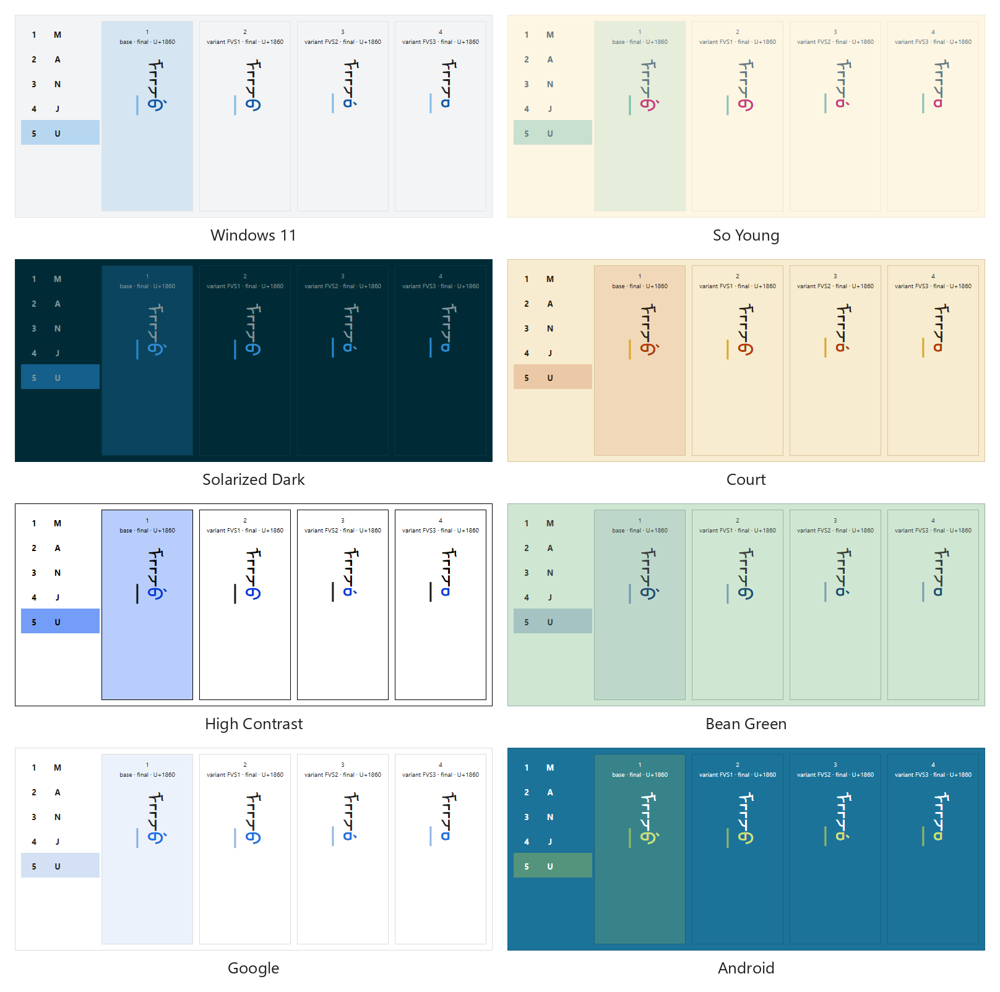

# Using Manju IME

This manual explains how to type Manchu with Manju IME, an input method editor (IME) for Windows. It
starts with what the IME does, then goes through typing one word, the window that shows the word, and
every key the IME uses. [Installing Manju IME](installation.md) covers setup.

## What Manju IME does

On a keyboard, each key normally puts one letter into your document. Manju IME works in two steps. First,
the letters you type go into a small window beside the text, the candidate window, which shows them as a
Manchu word; the document shows a mark where the word will go. Then, when you press **Space**, the word
goes into the document in Manchu letters. Until then you can add letters, delete them, or pick another
form of a letter.

You spell each word in Latin letters, with one of six input schemes: [Input schemes](romanization.md)
shows each of them letter by letter.

## Switch to Manju IME

Press **Win+Space** and pick Manju IME. It is listed under the language you chose in Setup.

## Type a word

1. Type the letters of a word, for example `nama`. The candidate window opens beside the text and shows
   ᠨᠠᠮᠠ.
2. Press **Space**. ᠨᠠᠮᠠ goes into your document, and the candidate window closes.

*The candidate window after typing `šanyan` with the Möllendorff input scheme: `s`, a tap of
**Shift**, then `anyan`.*

## The candidate window

The candidate window has two parts.

- **The letters typed**, on the left: one row for each letter of the word. A letter spelled with two
  Latin letters takes one row, such as `ng`, and so does a whole syllable, such as `sy`. One row is
  highlighted: at first the last one.
- **The cards**, on the right: each card shows the whole word, with a different form of the letter
  of the highlighted row. The first line of a card names the form: `base` is the plain form, and
  `variant FVS1` is the form that free variation selector 1 (U+180B) selects. Then come the position of
  the letter in the word, such as `final`, and the letter’s code point, the number Unicode gives it.

*`ng` is one letter in every scheme and takes one row: `angga` (mouth), typed with the Möllendorff input
scheme.*

*A whole syllable is one row too: `sy`, and the `jy` of `jytu`, typed with the Möllendorff input scheme.*

*Followed by `g`, `ng` is drawn as one glyph with it: `angga` with the row of `ng` highlighted, after
**Up** twice, in the Möllendorff input scheme.*

*Each card shows another form of the highlighted letter: `gisun` and `bithe`, typed with the Möllendorff
input scheme.*

## Keys

The table is for Manchu input; in Latin input every key works as it does without an IME. While you type a
word, the keys act on the word. When you are not typing a word, most keys go to the program you type in, as
they would without an IME.

| Key | While you type a word | When you are not typing a word |
|---|---|---|
| A letter | Adds the letter to the word. A letter that the input scheme does not use joins the letters typed as itself, and goes into the document as that Latin letter. Caps Lock, and **Shift** held with a letter, make no difference. | Starts a word. A letter that the scheme does not use goes into the document as itself. |
| **Space** | Puts the word into the document in Manchu letters, with the forms you picked. | Types a space. |
| **Enter** | Puts the letters you typed into the document as they are, in Latin letters. | Goes to the program. |
| **Esc** | Cancels the word: nothing goes into the document. | Goes to the program. |
| **Backspace** | Takes back the last pick; when no letter has a pick, deletes the last letter typed. Deleting the only letter closes the candidate window. | Goes to the program. |
| **1** to **9** and **0**, also on the numeric keypad | Picks the card with that number for the highlighted letter: see [Pick a form with the number keys](#pick-a-form-with-the-number-keys). A number with no card does nothing. | Types the digit. |
| **Up**, **Down** | Moves the highlight to the letter before or after. | Goes to the program. |
| **Left**, **Right** | Moves the highlight to the card before or after; this does not pick the card. | Goes to the program. |
| **Page Up**, **Page Down** | When the word has more letters than the window shows, shows the rows before or after, and highlights the first letter shown. | Goes to the program. |
| **Tab** | Goes to the program. Microsoft Edge, Google Chrome and the other programs built on Chromium end the word when they get it, so Manju IME first puts the word into the document as you typed it: see [Leaving a word](#leaving-a-word). In other programs, such as Notepad, the word stays open. | Goes to the program. |
| **Ctrl**, **Alt** or **Win** with another key, and **F1** to **F12** | Go to the program. In Microsoft Edge, Google Chrome and the other programs built on Chromium, Manju IME first puts the word into the document as you typed it, as it does for **Tab**; a key that takes you to another program, such as **Alt+Tab** or **Win+D**, drops the word: see [Leaving a word](#leaving-a-word). | Go to the program. |
| **Shift**, tapped | Adds the mark or the apostrophe to the letter before it: see [Tap Shift in the middle of a word](#tap-shift-in-the-middle-of-a-word). | Switches between Latin and Manchu input: see [Switch between Latin and Manchu](#switch-between-latin-and-manchu). |
| `'` | Separates two letters, or, pressed a second time, puts the letters typed into the document as they are, followed by an apostrophe: see [The apostrophe key](#the-apostrophe-key). | Types an apostrophe. |
| `-` | Inserts the Mongolian vowel separator: see [Suffixes](#suffixes). | Types a hyphen. |
| **Shift**+**Space** | Does the same as `-`. | Starts a word that holds only the vowel separator, shown as a dot in the document, with no candidate window. |
| `,` `.` **Shift**+`;` `[` `]` | Adds the Manchu punctuation mark ᠂, ᠃, ᠄, ᠈ or ᠉ to the word: see [Punctuation](#punctuation). | Starts a word with that mark. |
| Any other symbol key, and **Shift** with a digit | Adds the symbol printed on the key, which goes into the document as it is. | Starts a word with that symbol. |
| **Delete**, **Home**, **End** | Change nothing. | Go to the program. |

### Leaving a word

When you switch to another program with **Alt+Tab** in the middle of a word, Manju IME drops the word, as
**Esc** does, and nothing goes into the document. When the program you type in ends the word itself, for
example when Microsoft Edge moves to another field on **Tab**, on a click or on a key such as **Ctrl+L**
or **F6**, or when you click another window of Edge, the word goes into the document as you typed it:
the letters you picked in their Manchu form, the others in Latin letters.

### Pick a form with the number keys

Each card shows the word with one form of the highlighted letter. To pick a form, press the number of its
card: the letter shows the picked form beside it, and the highlight moves on to the next letter when that
letter has no pick yet. When every letter has a pick, the word goes into the document. Otherwise **Space**
puts it there, and each letter without a pick keeps the form of its first card. Press **Up** or **Down** to
choose the letter first; **Left** and **Right** only move the highlight from card to card.

*`nama` typed with the Möllendorff input scheme, then **2**: the last letter shows the form of card 2, and
the word waits for **Space**.*

### Switch between Latin and Manchu

When you are not in the middle of a word, a short tap of **Shift** switches between Latin and Manchu
input. In Latin input the keys type as they do without an IME.

*`manju` in Manchu, a tap of **Shift**, `manju` in Latin letters, another tap of **Shift**, and `hergen`
being typed, with the Möllendorff input scheme.*

### Tap Shift in the middle of a word

A standard keyboard has no key for some spellings: the apostrophe in spellings such as `k'`, and `ū`,
`š` and `ž` in Möllendorff and Norman. For these, type the letters up to the apostrophe, or the letter
without its mark, then tap **Shift**: `k`, then **Shift**, gives `k'` in every scheme but BabelPad and Hu,
and in Möllendorff, `s`, then **Shift**, gives `š`. A second tap changes nothing.

In Möllendorff, `t` and `s` typed one after the other make the one letter `ts`, so **Shift** after them
gives `ts'`. For `t` followed by `š`, type `t`, the `'` key, `s`, then tap **Shift**.
[Spellings typed with Shift](romanization.md#spellings-typed-with-shift) lists every such spelling of
each scheme.

### The apostrophe key

In the middle of a word, the `'` key separates two letters that would otherwise make one: `ng` gives the
one letter ᠩ, and `n'g` gives ᠨ followed by ᡤ. The `'` key itself does not go into the document. Pressed a
second time, it puts the letters into the document as typed, in Latin letters, followed by an
apostrophe.

*`nga` and `n'ga`, typed with the Möllendorff input scheme: the `'` key separates `n` from `g`.*

### Punctuation

Five keys give Manchu punctuation: `,` gives ᠂, `.` gives ᠃, **Shift**+`;` gives ᠄, `[` gives ᠈ and `]`
gives ᠉. Every other symbol key, with or without **Shift**, gives the symbol printed on it, and in the
middle of a word the symbol joins the letters typed.

### Suffixes

In the middle of a word, `-` and **Shift**+**Space** insert the Mongolian vowel separator (U+180E), which
sets a suffix apart from the word before it: `bi`, `-`, `de` gives ᠪᡳ᠎ᡩᡝ. The settings file can make them
insert a narrow no-break space (U+202F) instead.

## Input and display schemes

The input scheme is the spelling you type. Pick one in the settings file, `keymap.scheme`:

| Input scheme | Name in the settings file |
|---|---|
| Abkai | `abkai` |
| BabelPad | `babelpad` |
| Hu | `hu` |
| Möllendorff, the default | `mollendorff` |
| Norman | `norman` |
| Refined Romanisation (draft) | `refined` |

The display scheme is the spelling that the letters typed show in the candidate window,
`display.scheme`. The default, `input`, shows what you typed; the name of an input scheme shows that
scheme’s spelling, whatever you typed. It changes only the Latin letters on the screen, not the Manchu
that goes into the document.

*`shun` typed with Refined Romanisation (draft), shown as `šun` with the display scheme set to
Möllendorff.*

## Themes

*The candidate window after typing `manju` with the Möllendorff input scheme, in each theme.*

To choose a theme, set `theme` under `appearance` in the settings file to `windows11`, `soyoung`,
`solarizeddark`, `court`, `highcontrast`, `beangreen`, `google` or `android`. The next key you press
after saving the file uses the new theme.

- **Windows 11**, the default: light gray, with blue highlights.
- **So Young**: the light colors of Solarized, a color scheme by Ethan Schoonover, with cyan and
  magenta highlights.
- **Solarized Dark**: the dark colors of Solarized, with blue highlights.
- **Court**: warm gold, with vermilion highlights and gold lines.
- **High Contrast**: black on white, with blue highlights.
- **Bean Green**: pale green, with navy blue highlights.
- **Google**: white, with blue highlights.
- **Android**: deep teal, with white text and yellow-green highlights.

## The settings file

The settings are in `Runtime\Resource\Configuration\configuration.yaml`, in the folder Manju IME is
installed in. It is a YAML file, plain text with one setting per line, and it describes each setting.
`keymap.scheme` is the input scheme and `display.scheme` the display scheme.

Save the file, and most changes apply at the next key you press, half a second or more after saving.
Font settings apply the next time you switch to Manju IME. If the saved file holds a value Manju IME
cannot use, it ignores that version of the file and keeps its current settings. If Manju IME is
installed under `C:\Program Files`, saving the file needs administrator rights.

## Acknowledgments

The colors of the So Young and Solarized Dark themes come from
[Solarized](https://github.com/altercation/solarized), by Ethan Schoonover.

## License

This manual, with its pictures, is licensed under the Creative Commons Attribution 4.0 International
license (CC BY 4.0): see [LICENSE](LICENSE).
